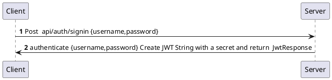

## Spring Boot Rest API JWT Authentication 

In this tutorial, we're gonna build a Spring Boot JWT Authentication with Spring Security<br> 
and PostgreSQL Application that supports Token based Authentication & Role based <br> Authorization.
You'll know:
* Appropriate flow for user signup & user login with JWT Authentication
* Spring Boot Application Architecture with spring security
* How to define data models and association for Authentication and Authorization
* Way to use spring data JPA to interact with PostgreSQL Database

## Overview Of Spring Boot JWT Authentication With PostgreSQL Example
We will build a Spring Boot application in that:
* User can signup new account , or login with username & password.
* By User's role ( admin, moderator,user, ect), we authorize the User to access resources

These are APIs that we need to provide:

<table>
    <tr>
    <th>Methods</th>
    <th>Urls</th>
    <th>Actions</th>
    </tr>
    <tr>
        <td>POST</td>
        <td>/api/auth/signup</td>
        <td>signup new account</td>
    </tr>
<tr>
        <td>POST</td>
        <td>/api/auth/signin</td>
        <td>login an account</td>
    </tr>
<tr>
        <td>GET</td>
        <td>/api/test/all</td>
        <td>retrieve public content</td>
    </tr>
<tr>
        <td>GET</td>
        <td>/api/test/user</td>
        <td>access User's content</td>
    </tr>
<tr>
        <td>GET</td>
        <td>/api/test/mod</td>
        <td>access Moderator's content</td>
    </tr>
<tr>
        <td>GET</td>
        <td>/api/test/admin</td>
        <td>access Admin's content</td>
    </tr>
</table>

## Spring Boot Signup & Login with JWT Authentication Flow

The diagram shows flow of how we implement User registration, User Login and Authorization process.

### Spring Security
- ```WebSecurityConfigurerAdapter``` is the crux of our security implementation. It provides HttpSecurity configurations to configure cors, csrf, session management, rules for protected resources. We can also extend and customize the default configuration that contains the elements below.
- ```UserDetailsService``` interface has a method to load User by Username and returns a ```UserDetails``` object that Spring Security can use for authentication and validation.
- ```UserDetails``` contains necessary information (such as: username, password, authorities) to build an Authentication object.
- ```UsernamePasswordAuthenticationToken``` gets {username, password} from login Request, AuthenticationManager will use it to authenticate a login account.
- ```AuthenticationManager``` has a ```DaoAuthenticationProvider``` (with help of ```UserDetailsService``` & ```PasswordEncoder```) to validate ```UsernamePasswordAuthenticationToken``` object. If successful, ```AuthenticationManager``` returns a fully populated Authentication object (including granted authorities).
- ```OncePerRequestFilter``` makes a single execution for each request to our API. It provides a ```doFilterInternal()``` method that we will implement parsing & validating JWT, loading User details (using ```UserDetailsService```), checking Authorizaion (using ```UsernamePasswordAuthenticationToken```).
- ```AuthenticationEntryPoint``` will catch authentication error.

<b>Repository</b> contains ``UserRepository`` & ``RoleRepository`` to work with Database, will be imported into <b>Controller</b>.

<b>Controller</b> receives and handles request after it was filtered by ``OncePerRequestFilter``.

– ``AuthController`` handles signup/login requests

– ``TestController`` has accessing protected resource methods with role based validations.

Understand the architecture deeply and grasp the overview more easier:
Spring Boot Architecture for JWT with Spring Security